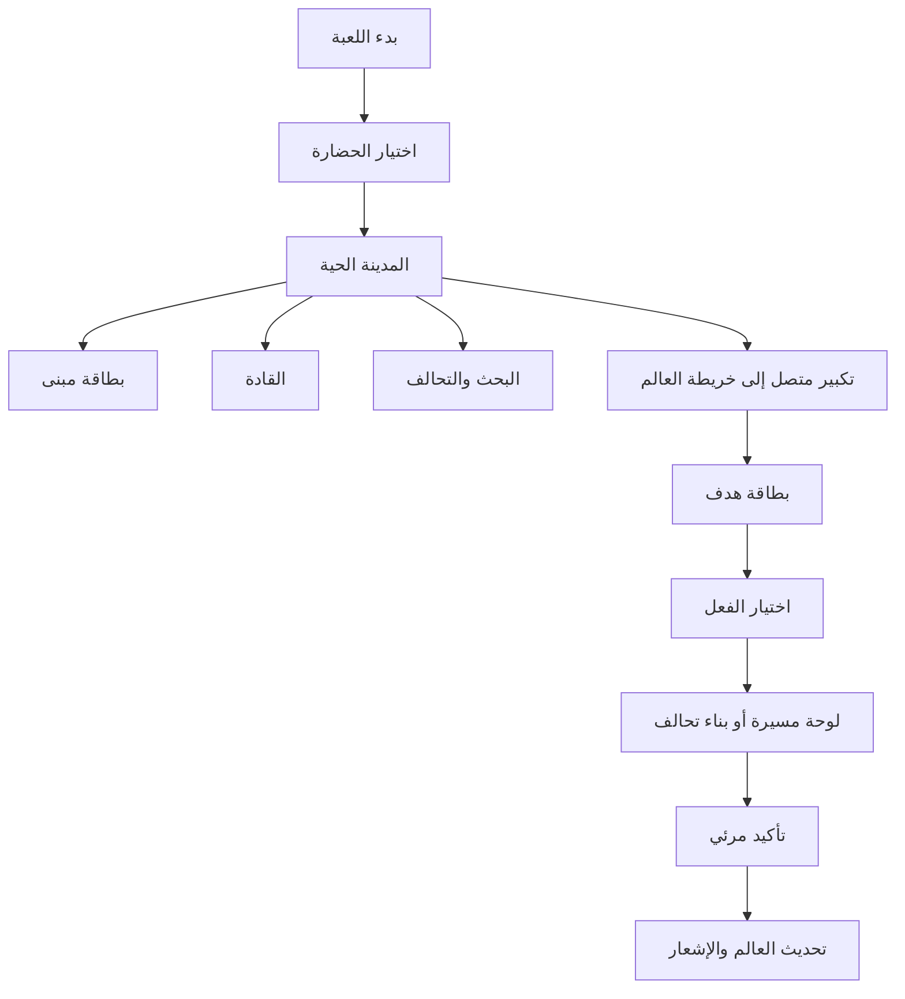

# هوية ROK2 البصرية ونظام الواجهة

> **حالة الوثيقة:** مرجع تصميمي ملزم. تستخدمها واجهات UMG، واجهات الخريطة، مواد المباني، والأيقونات. لا تعدّل وثيقة شاشة منفردة لوناً أو سلوكاً خارج ما ورد هنا.

## 1. الاتجاه الفني

ROK2 لعبة استراتيجية عالم مفتوح عن **صناعة المملكة، لا عن ازدحام القوائم**. تظهر القرارات أولاً في المدينة والخريطة: سقالات البناء، رايات التحالف، طرق التجارة، آثار المعارك ونطاقات الدفاع. الواجهة طبقة قيادة خفيفة فوق عالم ملموس وليست بديلاً منه.

الأسلوب هو **مخطوطة ميدانية ملكية**: ورق داكن متين، معدن مصبوب، حجر محفور، وخشب مدهون بلون الحضارة. لا تُقلّد هذه اللغة واجهة لعبة بعينها؛ بل تمنح ROK2 شخصية مستقلة قابلة للتوسع عبر الحضارات والمواسم.

| ركيزة | القرار | اختبار القبول |
|---|---|---|
| العالم أولاً | لا تفتح لوحة كاملة إلا للقرارات المركبة؛ أمّا البناء والهدف والمسيرة فتُدار من بطاقات سفلية. | يظهر العالم خلف كل لوحة تشغيلية. |
| الفعل واضح | لكل فعل رئيسي رمز، فعل لفظي، تكلفة، وحالة مرئية. | لا يحتاج اللاعب إلى تفسير لون وحده أو فتح شاشة أخرى لفهم ما سيحدث. |
| الحضارة حاضرة لا طاغية | لون الحضارة نبرة ثانوية في الراية والحدود والزخارف، بينما تبقى ألوان الحالة عالمية. | لا يتغير معنى النجاح أو الخطر عند تبديل الحضارة. |
| اللمسة الملكية مقروءة | الزخرفة في الحواف، لا تحت النص أو الأرقام. | يبقى النص والأيقونة واضحين عند عرض الهاتف وتحت إضاءة منخفضة. |
| الحركة تخدم المعنى | كل حركة تؤكد فعل اللاعب أو تغيّر حالة العالم. | لا توجد حركة مستمرة لا تدل على تقدم أو خطر أو ملكية. |

## 2. لوحة الألوان الموحّدة

الألوان التالية **رموز تصميم** وليست أسماء ألوان حرة. يطبق العميل القيمة نفسها في UMG والمواد والخرائط المصغرة. تعديلات السطوع مرتبطة بالحالة ولا تنشئ لوناً دلالياً جديداً.

| الرمز | Hex | الاستخدام الأساسي | لا يستخدم لـ |
|---|---:|---|---|
| `Ink-950` | `#11100D` | الخلفيات العميقة والنص فوق الذهب | حالة الخطر |
| `Ink-800` | `#211B14` | سطح اللوحات والبطاقات | خلفية مشهد العالم |
| `Parchment-100` | `#F5E9D0` | النص الرئيسي والرموز الفاتحة | زر إتلاف/إلغاء |
| `Bronze-500` | `#9B6A2F` | الحواف المعدنية العادية | مكافأة نادرة |
| `Gold-500` | `#D4A82F` | الإجراء الرئيسي، الموارد النادرة، حلقة الاختيار | النص الطويل |
| `Gold-200` | `#F2D878` | لمعان التحديد والعدادات المكتملة | مؤقّتات الإنذار |
| `Verdant-500` | `#3E7C4F` | نجاح، شفاء، اتصال، مسار آمن | ملكية التحالف وحدها |
| `Ember-600` | `#B54032` | هجوم، ضرر، إنذار، إلغاء مدمر | زر ترقيات عادية |
| `Azure-500` | `#3A7198` | معلومات، استكشاف، مياه، مسيرات صديقة | مورد ذهب |
| `Violet-500` | `#6C4D8F` | سحر/موسمي/نادر | حالة تفاعلية عامة |

> **قاعدة القراءة:** كل حالة تعتمد على ثلاث إشارات على الأقل: لون + رمز + شكل أو حركة. حد العنصر التفاعلي ومؤشر التحديد يحققان تبايناً مرئياً لا يقل عن `3:1` مع الخلفية الملاصقة، ولا تعتمد الحالة على تبديل اللون فقط. [1]
>
> **نقطة التنفيذ:** يترجم `game/client-unreal/Source/Rok2/Public/Rok2VisualTheme.h` هذه الرموز إلى واجهات UMG/Slate. لا تضع الواجهات ألواناً دلالية ثابتة محلياً؛ أضف الرمز إلى `Rok2VisualTheme` وحدّث هذا الجدول وفحص `test:visual-contract`.

### 2.1 ثيمات الحضارات

تطبق الحضارة طبقة نبرة فقط: الراية، السقف، شريط عنوان بطاقة المدينة، وهالة التحديد الخاصة بها. تحافظ الواجهة على `Gold-500` للفعل الرئيسي و`Ember-600` للخطر في جميع الحضارات.

| الحضارة | نبرة أساسية | نبرة ثانوية | خامة المدينة | الزخرفة |
|---|---:|---:|---|---|
| روما | `#8B1E1E` | `#D8C3A5` | رخام دافئ وطوب فاتح | عقود نصف دائرية وغار |
| الصين | `#B5121B` | `#F0C14A` | خشب مطلي وقرميد مزجج | سحب وهندسة سقف متدرج |
| العرب | `#C9A227` | `#1F3D2B` | حجر رملي وبلاط فيروزي | أقواس وقباب ونقش هندسي |
| مصر | `#0E7C7B` | `#E1B84B` | حجر كلسي وجرانيت | بردي وجعران ومسلات |
| الفايكنج | `#2E4057` | `#8AA0B4` | خشب داكن وحديد | عقدة حبل ورونيات مجردة |
| اليابان | `#111111` | `#9B1D20` | خشب فحمي وورق مزيت | توري وخطوط مشطوبة |

## 3. الخطوط والأرقام واللغة

يدعم كل مكوّن العربية من اليمين إلى اليسار والإنجليزية من اليسار إلى اليمين دون انقلاب في الأرقام أو موارد الاقتصاد. يستخدم العنوان **Cairo Black** أو بديل مرخّص مماثل، ويستخدم النص **Noto Kufi Arabic / Noto Sans Arabic** أو بديل مرخّص واضح. الأرقام والإحداثيات تستعمل خطاً tabular بحيث لا يقفز العرض عندما تتغير الموارد.

| الطبقة | حجم الهاتف | الاستخدام | قاعدة |
|---|---:|---|---|
| `Display` | 28–34 | اسم الحضارة، هدف الموسم | جملة قصيرة فقط |
| `H1` | 22–26 | عنوان لوحة | لا أكثر من سطرين |
| `H2` | 18–20 | عنوان قسم أو بطاقة | يرافقه رمز عند الحاجة |
| `Body` | 14–16 | وصف، تكاليف، تقرير | تباين عالٍ وخط مسافات مريحة |
| `Label` | 11–13 | عداد، وسم، حالة | لا يتجاوز كلمتين |
| `Numeric` | 14–18 | موارد، قوة، مدة | أرقام tabular واختصار K/M/B |

## 4. مكوّنات واجهة موحّدة

| المكوّن | الشكل | الحالات | سلوك الهاتف |
|---|---|---|---|
| زر رئيسي | ختم سداسي/دائري بحافة ذهب | عادي، ضغط، معطل، تحميل، خطر | منطقة لمس واسعة؛ الرسم لا يساوي مساحة اللمس |
| زر ثانوي | لوح ورق داكن بحافة برونزية | عادي، تحديد، تعطيل | يستخدم للتبديل والفلترة فقط |
| بطاقة هدف | Bottom Sheet بحافة مسمارين | مطوية، موسعة، مقفلة | تغلق بالسحب للأسفل وتبقي الهدف محدداً |
| بطاقة قائد | بورتريه ذو راية زاوية | مملوك، قيد الترقية، قابل للترقية، مقفل | النقر يختار؛ الضغط المطول يفتح المقارنة |
| شريط تقدم | مسار حجري + تعبئة دلالية | جارٍ، مكتمل، متوقف، معزز | يظهر الوقت المتبقي والتفاصيل عند النقر |
| حلقة خريطة | حلقة داخلية فاتحة وخارجية داكنة | صديق، عدو، تحالف، بناء صالح، بناء ممنوع | تتغير الموجة والحجم مع الحالة لا اللون فقط |
| Toast | راية صغيرة تنزلق من أعلى | خبر، نجاح، خطر، دعوة | لا يحجب اللعب ولا يتراكم أكثر من ثلاث رسائل |

## 5. بنية الشاشات والمسار الرئيسي

المدينة والخريطة ليستا شاشتين معزولتين. تستمر الموارد والمهام وإشعارات التحالف في الظهور، بينما يتغير مستوى التفصيل وطبقات التحكم فقط. أي رحلة تشغيلية متكررة، مثل ترقية مبنى أو بناء منشأة تحالف، يجب أن تنجز في ثلاث لمسات كحد أقصى بعد اختيار الهدف.

## 6. مواصفات HUD

### 6.1 المدينة

يظهر شريط الموارد في الأعلى، والمهام المصغرة في الجانب المقابل لاتجاه اليد المختار، وزر البناء في الربع السفلي المقابل للإبهام. لا يوضع زر مدفوع أو إجراء مدمر بجوار زر الترقية. تعرض كل حالة في العالم قبل أن تتكرر في الواجهة: بناء = سقالات، شفاء = راية طبية، طابور مكتمل = وميض قصير، هجوم = دخان/نبض على السور.

### 6.2 خريطة العالم

تستخدم الخريطة واجهة طبقات قابلة للطي: **أهداف**، **تحالف**، **تهديدات**، **موارد**، **تضاريس**. لا تتجاوز الأيقونات 25% من مساحة العرض عند أقل تكبير؛ عند الابتعاد تتحول المباني إلى رموز مع لون ملكية ونمط راية. يعرض تحديد هدف بطاقة واحدة فقط، ثم يكشف الفعل الملائم لسياقه: جمع، استكشاف، حراسة، تعزيز، هجوم، أو بناء تحالف.

### 6.3 القادة والقوة

لا يُعرض الرقم الإجمالي للقوة منفرداً. تحته دائماً تفكيك مصغر إلى: قوات، قادة، بحث، مبانٍ، معدات. يتيح ضغط مطوّل على أي عنصر تفسير تأثيره ومعادلته، ليتحول التقدم من غموض إلى قرار مفهوم.

## 7. الحركة والصوت

| الحدث | الحركة | المدة | الإشارة الصوتية |
|---|---|---:|---|
| لمس زر | انكماش 96% ثم رجوع | 90ms | نقرة خشبية خافتة |
| فتح بطاقة | ارتفاع + تعتيم خلفي جزئي | 220ms | ورق/معدن خفيف |
| اكتمال بناء | وميض ذهبي في العالم ثم Toast | 500ms | مطرقة ورنين |
| اختيار هدف | حلقة مزدوجة + نبضة واحدة | 350ms | نغمة موضعية قصيرة |
| دخول نطاق دفاع | موجة نصف شفافة من المنشأة | 650ms | جرس تحذير منخفض |
| خطر/هجوم | لا اهتزاز مستمر؛ نبضتان ثم مؤشر ثابت | 600ms | طبلة منخفضة |

تعطل الحركة الاختيارية من إعدادات الوصول. لا تستخدم الومضات السريعة، ولا يجوز أن تكون الحركة وحدها مصدر المعلومة.

## 8. مواصفات الإنتاج الفني

الأصول ثنائية الأبعاد للواجهة تُرسم بخطوط نظيفة وخامات مطبوعة خفيفة، مع نسخ `1x / 2x / 3x` أو Atlas واضح. الأصول داخل العالم تعتمد **مظهراً ثلاثي الأبعاد مبسطاً عالي القابلية للقراءة** من منظور استراتيجي علوي، مع تفاصيل مصغرة حادة كالأعلام والسقالات والعمال. إذا استُخدمت نسخة Pixel Art مستقبلاً، تبقى الشبكة والأيقونات والخامات خاضعة للرموز نفسها؛ لا تتغير دلالات الألوان أو نسب الواجهة.

## 9. قائمة قبول الواجهة

| الاختبار | معيار القبول |
|---|---|
| التباين | كل رمز/حد لازم للتفاعل أو للحالة يحقق `3:1` على خلفيته المباشرة. [1] |
| الحالات | لا توجد حالة تعتمد على لون فقط. |
| اليد الواحدة | الفعل الأساسي في كل شاشة يمكن الوصول إليه في المنطقة السفلى المفضلة. |
| الإبهام | مساحة اللمس أكبر من الرسم؛ لا تتداخل أهداف الأزرار الحرجة. [2] |
| الاستمرارية | يعود اللاعب إلى العالم نفسه بعد إغلاق بطاقة عملية. |
| اللغة | لا يظهر قص أو انعكاس للأرقام أو الإحداثيات بين العربية والإنجليزية. |

## المراجع

[1]: https://www.w3.org/WAI/WCAG21/Understanding/non-text-contrast.html "W3C — Non-text Contrast"
[2]: https://m3.material.io/foundations/designing/structure/touch-targets "Material Design — Touch targets"
